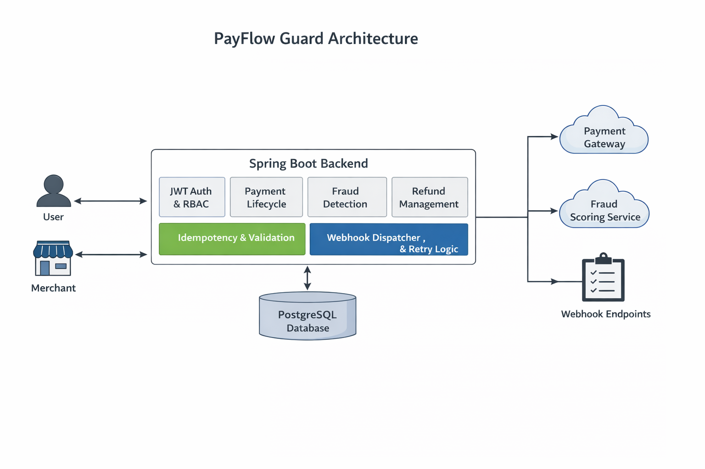
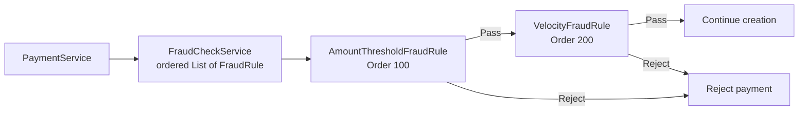
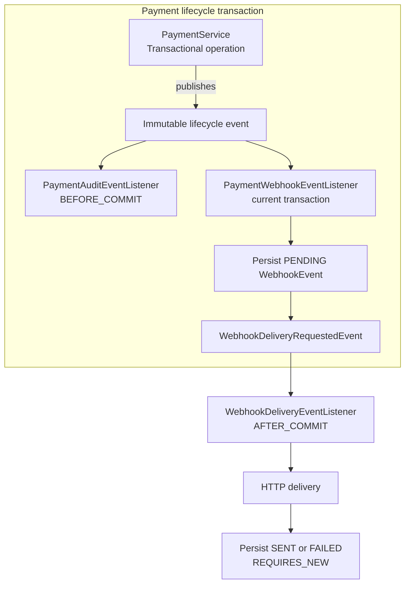
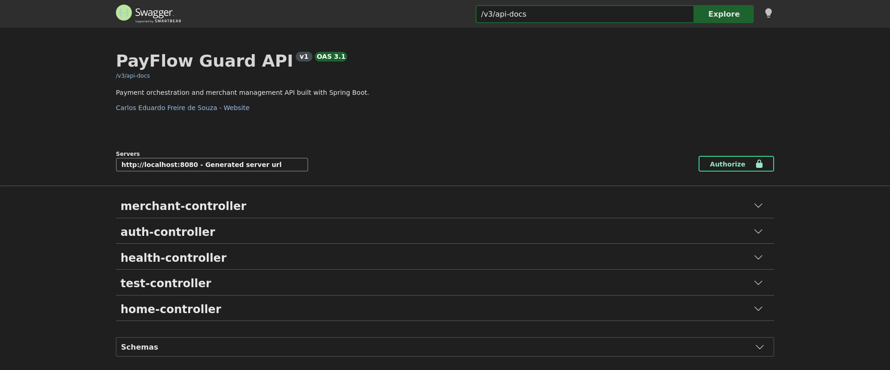
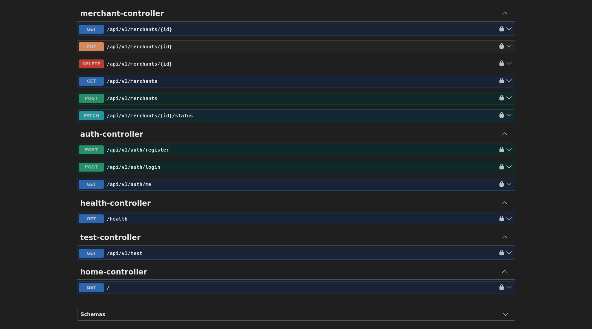
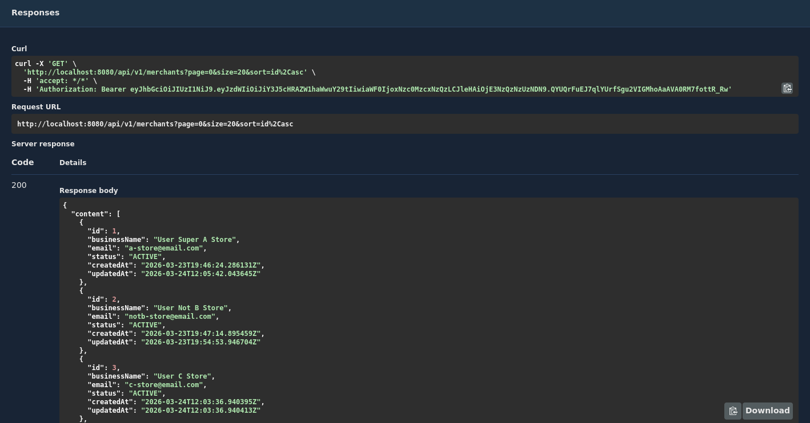

# PayFlow Guard 💳🛡️

[🇧🇷 Versão em Português](README.pt-BR.md)

PayFlow Guard is a backend API for merchant and payment management with a focus on security, scalability, and fraud-aware architecture.

Built with Java 21 and Spring Boot, the project models a real-world payment processing backend, including authentication, merchant management, payment lifecycle, refunds, idempotency, audit logs, automatic capture, and webhook delivery with retry.

---

## 🎯 Purpose

This project was designed to simulate a real-world payment backend similar to systems used by fintech companies.

It focuses on:

* secure transaction flows
* multi-tenant data isolation
* scalable API design
* clean architecture principles
* state-driven payment processing

---

## 🚀 Features

### 🔐 Authentication & Security

* JWT-based authentication
* BCrypt password hashing
* Secure login and registration
* Protected endpoints with token validation
* Multi-tenant data isolation (users only access their own data)
* Role-based access control (USER / ADMIN)

### 🏪 Merchant Management

* Create, update, delete merchants
* Pagination, filtering, and sorting
* Merchant status management (ACTIVE / INACTIVE)
* User-scoped data access

### 💳 Payment System

* Create payments linked to merchants
* Full lifecycle:
  * `PENDING → AUTHORIZED → CAPTURED → REFUNDED / FAILED`
* Strict state transition validation
* Admin-controlled state updates
* Automatic capture via scheduler

### 🧪 Fraud Detection

* Automatic fraud validation on payment creation
* Fraud rules:
  * High-value transactions blocked
  * Rapid repeated transactions blocked
* Fraud reason stored and returned in API

### 🔁 Idempotency

* Prevents duplicate payment creation
* Uses `Idempotency-Key` header
* Same request returns the same payment
* Scoped per merchant

### 💸 Refund System

* Partial refunds supported
* Multiple refunds per payment
* Aggregated refund tracking
* Individual refund records persisted

### 📜 Refund History

* `GET /api/v1/payments/{id}/refunds`
* Full refund timeline per payment

### ⚙️ Automatic Capture

* Scheduled process:
  * `AUTHORIZED → CAPTURED`
* Publishes the same lifecycle events used by manual transitions
* Audit and webhook side effects are handled by observers

### 📡 Webhooks

* Event: `payment.status.updated`
* Durable `PENDING` event persistence before delivery
* Real HTTP delivery after the payment transaction commits
* Delivery tracking
* Retry mechanism for failures

### 🧾 Audit Logging

Tracks:

* payment status changes
* refunds
* overrides
* automatic operations

### 📊 API Design

* RESTful endpoints (`/api/v1/...`)
* Clean request/response DTOs
* Global exception handling
* Consistent error response structure
* Proper HTTP status codes

### 🧪 Tests

* Focused unit tests for fraud rules, event publishers, and listeners
* Isolated integration tests for idempotency, refunds, lifecycle transitions, and transaction phases
* In-memory H2 test database with scheduling disabled

---

## 🔐 Roles and Access Model

New users are created with the `USER` role by default.

Some operations are restricted to `ADMIN`, such as:

* payment status updates
* payment status overrides
* refunds
* webhook event inspection and operational flows

In the current development setup, admin privileges can be granted directly in PostgreSQL:

```sql
UPDATE users
SET role = 'ADMIN'
WHERE email = 'user@test.com';
```

This keeps the application flow simple while still allowing administrative scenarios to be tested locally.

---

## 🔒 Security Highlights

* Stateless authentication using JWT
* Passwords stored using BCrypt hashing
* Endpoint protection via Spring Security filters
* User-level data isolation enforced at query level

---

## 🧱 Tech Stack

* Java 21
* Spring Boot
* Spring Security
* Spring Data JPA (Hibernate)
* PostgreSQL (Docker)
* JWT (authentication)
* Maven
* Swagger / OpenAPI (springdoc)

---

## 🏗️ Architecture

The project follows a layered architecture:

```text
Controller → Service → Repository → Database
```

* **Controller**: Handles HTTP requests/responses
* **Service**: Business logic and validation
* **Repository**: Data access (JPA)
* **DTOs**: Clean API contracts (no entity leakage)

### Key Design Decisions

* Use of DTOs to decouple API from persistence layer
* Enum modeling for controlled domain values
* Centralized exception handling with `@RestControllerAdvice`
* Stateless authentication with JWT
* Per-user data isolation enforced at query level

### Conceptual Architecture Diagram



---

## 🧩 Design Patterns

PayFlow Guard applies patterns where they solve existing payment-processing problems. The repository does not contain isolated pattern demos or extra abstractions added only to increase the pattern count.

### 1. Chain of Responsibility — fraud validation

**Problem.** Payment creation needs several independent fraud checks, but coupling every check directly to `PaymentService` would make the service grow whenever a rule was added or reordered.

**Implementation.** `FraudRule` is the common handler contract. Spring discovers the concrete `AmountThresholdFraudRule` and `VelocityFraudRule` beans and injects them into `FraudCheckService` as an ordered `List<FraudRule>`. `@Order(100)` runs the inexpensive amount check first; `@Order(200)` runs the database-backed velocity check second. The coordinator stops at the first rejection and returns that result unchanged.



This is intentionally a Spring-friendly, externally coordinated Chain of Responsibility. The rule objects do not manually hold references to successor handlers. A new rule is added as another ordered Spring component, without changing `PaymentService` or the coordinator.

### 2. Observer / Publisher-Subscriber — payment lifecycle side effects

**Problem.** Status changes, overrides, refunds, and automatic capture previously coordinated audit logging and webhook delivery directly. That mixed lifecycle decisions with side effects and made additional reactions harder to introduce safely.

**Implementation.** Transactional `PaymentService` operations publish either `PaymentStatusChangedEvent` or `PaymentRefundCreatedEvent`. These immutable records contain value snapshots and IDs rather than JPA entities. `PaymentAuditEventListener` writes the mandatory audit at `BEFORE_COMMIT`, while `PaymentWebhookEventListener` persists a durable `PENDING` webhook record in the current transaction and publishes `WebhookDeliveryRequestedEvent`. `WebhookDeliveryEventListener` performs HTTP only at `AFTER_COMMIT`; delivery results are saved with `REQUIRES_NEW`.



The payment transition, mandatory audit, and webhook enqueue therefore commit or roll back together. HTTP is outside that transaction, so an ordinary delivery failure cannot undo an already committed payment. Additional observers can react to lifecycle events without adding orchestration to `PaymentService` or `PaymentAutoCaptureService`.

Spring application events remain synchronous and in-process. This design does not claim the guarantees of Kafka, RabbitMQ, asynchronous execution, a transactional outbox, CQRS, or event sourcing.

### Architectural evolution and bootcamp context

The project first extracted fraud checks into independent, ordered rules and formalized them as a Chain of Responsibility. Payment lifecycle auditing and webhook publication were then decoupled through Observer / Publisher-Subscriber, with explicit transaction phases for atomic persistence and after-commit HTTP delivery.

That evolution makes PayFlow Guard suitable as a Design Patterns bootcamp submission: the patterns address real fraud-validation and payment-lifecycle concerns instead of serving as standalone classroom examples.

---

## 🧠 Architecture Walkthrough

The system follows a layered architecture with clear separation of concerns:

```text
Controller → Service → Repository → Database
```

### 🔄 Request Flow

1. A request hits the **Controller**
2. The controller validates input and forwards it to the **Service layer**
3. The service:
   * applies business rules
   * enforces state transitions
   * handles fraud checks
   * ensures idempotency
4. The service interacts with the **Repository layer**
5. The repository persists or retrieves data from the **Database**
6. The response is mapped to a DTO and returned to the client

### ⚙️ Example: Payment Creation Flow

```text
Client
  ↓
PaymentController
  ↓
PaymentService
  ↓
FraudCheckService
  ↓
Idempotency validation
  ↓
PaymentRepository
  ↓
Database
  ↓
PaymentResponse
```

### 🔁 Example: Payment Lifecycle Update

```text
Client
  ↓
PaymentController
  ↓
PaymentService
  ↓
Validate transition
  ↓
Save payment and publish PaymentStatusChangedEvent
  ↓
Observers join the current transaction
  ├─ Persist PENDING webhook
  └─ Persist mandatory audit BEFORE_COMMIT
  ↓
Commit payment transaction
  ↓
AFTER_COMMIT: deliver webhook and persist result in REQUIRES_NEW
  ↓
Response
```

### 💸 Example: Refund Flow

```text
Client
  ↓
PaymentController
  ↓
PaymentService
  ↓
Validate refund rules
  ↓
Create refund record
  ↓
Update refunded total
  ↓
Save payment and publish PaymentRefundCreatedEvent
  ↓
Observers join the current transaction
  ├─ Persist PENDING webhook
  └─ Persist mandatory audit BEFORE_COMMIT
  ↓
Commit, then deliver webhook AFTER_COMMIT
  ↓
Response
```

### 📡 Example: Automatic Capture Flow

```text
Scheduler
  ↓
PaymentAutoCaptureService
  ↓
Find AUTHORIZED payments
  ↓
Delegate each payment to PaymentService
  ↓
Transactional capture publishes PaymentStatusChangedEvent
  ↓
Audit and webhook observers handle side effects
```

### 🧩 Key Design Principles

* **Separation of concerns**
  Each layer has a focused responsibility

* **State-driven design**
  Payment lifecycle is enforced through controlled transitions

* **Idempotency-first mindset**
  Prevents duplicate financial operations

* **Auditability**
  Every critical action is traceable

* **Resilience**
  Webhooks are retried on failure

---

## 🔑 Authentication Flow

1. User registers:

```text
POST /api/v1/auth/register
```

2. User logs in:

```text
POST /api/v1/auth/login
```

3. API returns JWT token

4. Token is used in requests:

```text
Authorization: Bearer <token>
```

---

## 📦 Example Endpoints

### Get current user

```text
GET /api/v1/auth/me
```

### Create merchant

```text
POST /api/v1/merchants
```

### Get merchants (with pagination)

```text
GET /api/v1/merchants?page=0&size=20&sort=id,asc
```

### Update merchant status

```text
PATCH /api/v1/merchants/{id}/status
```

### Create payment

```text
POST /api/v1/payments
Header: Idempotency-Key
```

### Update payment status

```text
PATCH /api/v1/payments/{id}/status
```

### Refund payment

```text
POST /api/v1/payments/{id}/refund
```

### Refund history

```text
GET /api/v1/payments/{id}/refunds
```

---

## 📥 Example Response

```json
{
  "id": 1,
  "businessName": "My Store",
  "email": "store@email.com",
  "status": "ACTIVE",
  "createdAt": "2026-03-24T10:30:00Z",
  "updatedAt": "2026-03-24T10:30:00Z"
}
```

---

## ⚙️ Running Locally

### 1. Clone repository

```bash
git clone https://github.com/souzacef/payflow-guard.git
cd payflow-guard
```

### 2. Start PostgreSQL

```bash
docker compose up -d
```

### 3. Run the application

```bash
./mvnw spring-boot:run
```

### 4. Access Swagger UI

http://localhost:8080/swagger-ui/index.html

---

## 🧪 Testing

Run the complete suite with:

```bash
./mvnw test
```

The ordinary test suite uses an isolated in-memory H2 database, disables scheduling, and requires neither PostgreSQL nor Docker. General integration tests do not make outbound webhook calls. A dedicated transaction integration test starts a loopback-only HTTP server and exercises the real after-commit webhook delivery path without contacting an external service.

Current suite status at the time of this documentation update: **40 tests passing** across fraud validation, payment lifecycle events, audit/webhook observers, transaction phases, idempotency, and refunds.

---

## 🧪 Manual API Test Flow

1. Register user
2. Login and get JWT
3. Authorize in Swagger
4. Create merchant
5. Create payment
6. Move payment to `AUTHORIZED`
7. Wait for automatic capture
8. Perform partial refunds
9. Retrieve refund history

---

## 📡 Webhook Delivery Behavior

Lifecycle transactions persist webhook events as `PENDING` before commit. HTTP delivery begins only after the payment transaction commits, and the delivery result is persisted independently.

The system supports:

* real HTTP delivery
* automatic retry for failed deliveries
* tracking of response status codes
* storage of failure details for observability

If a target URL is invalid or unreachable, the event is marked as failed instead of being silently lost.

Delivery uses synchronous, in-process Spring events rather than a distributed message broker or transactional outbox.

---

## 📸 API Preview





---

## 📌 Roadmap

* [x] Payment lifecycle
* [x] Fraud detection rules
* [x] Role-based access (ADMIN / USER)
* [x] Webhooks with retry
* [x] Refund system with history
* [x] Idempotency
* [x] Automatic capture
* [x] Integration tests
* [ ] External payment gateway integration
* [ ] FX / currency conversion
* [ ] Advanced fraud rules

---

## 👨‍💻 Author

Carlos Eduardo Freire de Souza  
Backend Developer focused on Java, APIs and scalable backend systems

GitHub: https://github.com/souzacef  
LinkedIn: https://linkedin.com/in/carlosefsouza

---

## 💡 Notes

This project was built as a portfolio piece with focus on:

* real-world backend patterns
* clean architecture
* production-like behavior
* stateful business rules

---

## 🧠 Final Thought

Payments are not just transactions.

They are **state machines with consequences**.
