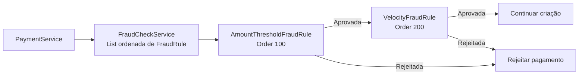
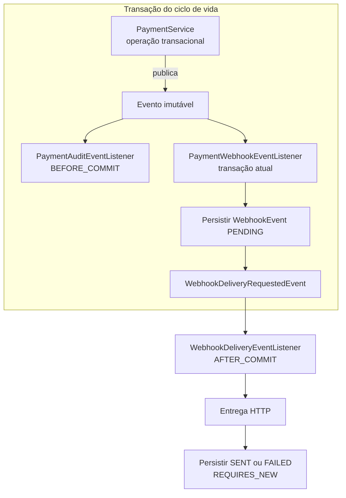

# PayFlow Guard 💳🛡️

[🇺🇸 English Version](README.md)

PayFlow Guard é uma API backend para gestão de merchants e pagamentos, com foco em autenticação, isolamento de dados, validação antifraude e processamento orientado pelo ciclo de vida do pagamento.

Desenvolvido com Java 21 e Spring Boot, o projeto evolui um domínio real de pagamentos para aplicar padrões de projeto onde eles resolvem problemas arquiteturais concretos: Chain of Responsibility na validação de fraude e Observer / Publisher-Subscriber nos efeitos colaterais do ciclo de vida.

---

## 🎯 Objetivo

O projeto modela comportamentos comuns de um backend de pagamentos:

* autenticação e autorização por papéis
* isolamento de dados por usuário
* idempotência na criação de pagamentos
* validação de fraude extensível
* transições controladas de status
* reembolsos parciais e totais
* auditoria transacional
* captura automática
* entrega e retry de webhooks

---

## 🚀 Funcionalidades

### 🔐 Autenticação e Segurança

* Autenticação stateless com JWT
* Hash de senhas com BCrypt
* Registro e login
* Endpoints protegidos por Spring Security
* Controle de acesso por papéis (`USER` / `ADMIN`)
* Isolamento de dados por usuário

### 🏪 Gestão de Merchants

* Criação, atualização e exclusão
* Paginação, filtros e ordenação
* Status `ACTIVE` / `INACTIVE`
* Acesso limitado ao proprietário, com operações administrativas específicas

### 💳 Sistema de Pagamentos

* Pagamentos vinculados a merchants
* Fluxo normal suportado:
  * `PENDING → AUTHORIZED → CAPTURED → REFUNDED`
  * `PENDING → FAILED` ou `AUTHORIZED → FAILED`
* `FAILED` e `REFUNDED` são estados terminais no fluxo normal
* Reembolso total move um pagamento `CAPTURED` para `REFUNDED`
* Reembolso parcial mantém o pagamento como `CAPTURED`
* Validação de transições e override administrativo separado

### 🧪 Detecção de Fraude

* Validação automática durante a criação do pagamento
* Regra de limite de valor
* Regra de velocidade de transações
* Motivo da primeira rejeição persistido e retornado pela API

### 🔁 Idempotência

* Header obrigatório `Idempotency-Key`
* Consulta idempotente antes da validação de fraude
* Uma repetição válida retorna o pagamento já existente
* Chaves isoladas por merchant

### 💸 Reembolsos

* Reembolsos parciais e totais
* Múltiplos registros de reembolso por pagamento
* Total reembolsado agregado
* Proteção contra valores inválidos e reembolso acima do saldo capturado
* Histórico em `GET /api/v1/payments/{id}/refunds`

### ⚙️ Captura Automática

* Scheduler localiza pagamentos `AUTHORIZED`
* `PaymentAutoCaptureService` delega cada captura ao `PaymentService`
* A transição `AUTHORIZED → CAPTURED` publica o mesmo evento de ciclo de vida usado nas operações manuais
* Auditoria e webhook são tratados pelos observers

### 📡 Webhooks

* Registro durável com status `PENDING` antes da entrega
* HTTP executado somente depois do commit da transação do pagamento
* Persistência independente do resultado de entrega
* Rastreamento de tentativas, código HTTP e detalhes de falha
* Retry manual e automático para entregas com falha

### 🧾 Auditoria

Registra mudanças de status, overrides, reembolsos e operações automáticas. A auditoria obrigatória participa da transação do ciclo de vida antes do commit.

### 📊 API

* Endpoints REST em `/api/v1/...`
* DTOs para request e response
* Tratamento global de exceções
* Estrutura consistente de erros
* Swagger / OpenAPI

---

## 🔐 Papéis e Acesso

Novos usuários recebem o papel `USER` por padrão. Operações como atualização ou override de status, reembolso e inspeção operacional de webhooks exigem `ADMIN`.

No ambiente local de desenvolvimento, o papel pode ser ajustado diretamente no PostgreSQL:

```sql
UPDATE users
SET role = 'ADMIN'
WHERE email = 'user@test.com';
```

---

## 🔒 Configuração de Segurança

* O repositório não inclui segredo JWT para o uso normal da aplicação.
* O segredo deve ser fornecido em `JWT_SECRET` e deve ser forte.
* A propriedade Spring correspondente é `app.security.jwt.secret`.
* O destino padrão de webhook é somente local.
* Um endpoint externo só é utilizado quando `PAYFLOW_WEBHOOK_URL` é configurada explicitamente.

Essas escolhas evitam publicar material de assinatura ou enviar dados de webhook para terceiros por padrão, sem alegar que o projeto seja uma solução completa de segurança de produção.

---

## 🧱 Stack Tecnológica

* Java 21
* Spring Boot
* Spring Security
* Spring Data JPA / Hibernate
* PostgreSQL para execução normal
* H2 em memória para testes
* Maven Wrapper
* JWT (`jjwt`)
* Swagger / OpenAPI (`springdoc`)

---

## 🏗️ Arquitetura

O núcleo segue uma arquitetura em camadas:

```text
Controller → Service → Repository → Database
```

* **Controller**: contratos e respostas HTTP
* **Service**: regras de negócio e transações
* **Repository**: persistência JPA
* **DTOs**: contratos da API sem exposição de entidades

Outras decisões incluem enums para valores de domínio, tratamento centralizado com `@RestControllerAdvice`, autenticação stateless e isolamento por usuário nas consultas.


---

## 🧩 Padrões de Projeto Aplicados

Os padrões abaixo foram incorporados a fluxos existentes do projeto. Não são exemplos isolados criados apenas para demonstrar teoria.

### 1. Chain of Responsibility — validação de fraude

**Problema.** Concentrar todas as verificações antifraude no `PaymentService` faria o serviço crescer sempre que uma regra fosse adicionada ou reordenada.

**Implementação.** `FraudRule` é o contrato comum. O Spring descobre `AmountThresholdFraudRule` e `VelocityFraudRule` e injeta os handlers no `FraudCheckService` como uma `List<FraudRule>` ordenada. `@Order(100)` executa primeiro a regra de valor, que é mais barata; `@Order(200)` executa depois a consulta de velocidade. A avaliação para imediatamente na primeira falha e devolve seu resultado sem alteração.



É uma Chain of Responsibility adequada ao Spring, coordenada externamente. Os handlers não armazenam manualmente uma referência ao próximo. Para adicionar uma regra, basta criar outro componente `FraudRule` ordenado; `PaymentService` e `FraudCheckService` não precisam ser alterados.

### 2. Observer / Publisher-Subscriber — efeitos do ciclo de vida

**Problema.** Mudanças de status, overrides, reembolsos e captura automática antes coordenavam auditoria e webhook diretamente, misturando a decisão de negócio com seus efeitos colaterais.

**Implementação.** Operações transacionais do `PaymentService` publicam `PaymentStatusChangedEvent` ou `PaymentRefundCreatedEvent`. Esses eventos são records imutáveis e carregam IDs e snapshots de valores, nunca entidades JPA gerenciadas.

* `PaymentAuditEventListener` grava a auditoria obrigatória em `BEFORE_COMMIT`.
* `PaymentWebhookEventListener` persiste o `WebhookEvent` como `PENDING` na transação atual e publica `WebhookDeliveryRequestedEvent`.
* O enqueue do webhook e a alteração principal confirmam ou sofrem rollback juntos.
* `WebhookDeliveryEventListener` inicia o HTTP somente em `AFTER_COMMIT`.
* `WebhookEventService` persiste o resultado em uma transação independente com `REQUIRES_NEW`.



A transição, a auditoria obrigatória e o enqueue do webhook são atômicos. Uma falha HTTP comum não desfaz um pagamento já confirmado. Os serviços de ciclo de vida não orquestram diretamente auditoria e webhook, e novos observers podem reagir sem aumentar suas dependências.

Os eventos do Spring utilizados aqui são síncronos e executados no próprio processo. O projeto não afirma ter as garantias de Kafka, RabbitMQ, outbox transacional, CQRS ou event sourcing.

### Evolução arquitetural e contexto do bootcamp

O projeto primeiro extraiu e ordenou regras de fraude, formalizando a Chain of Responsibility. Depois, desacoplou auditoria e webhooks com Observer / Publisher-Subscriber e fases transacionais explícitas. Assim, os padrões resolvem necessidades reais do domínio e ficam claros para avaliação sem transformar a aplicação em um exemplo artificial de sala de aula.

---

## 🧠 Fluxos Principais

### Criação de pagamento

```text
Cliente
  ↓
PaymentController
  ↓
PaymentService
  ↓
Validar Idempotency-Key e carregar merchant
  ↓
Consultar idempotência (retornar o existente, se encontrado)
  ↓
Validar merchant ativo
  ↓
FraudCheckService
  ↓
PaymentRepository
  ↓
PaymentResponse
```

### Atualização do ciclo de vida

```text
Cliente → PaymentController → PaymentService
  ↓
Validar transição
  ↓
Salvar pagamento e publicar PaymentStatusChangedEvent
  ↓
Observers na transação atual
  ├─ Auditoria obrigatória BEFORE_COMMIT
  └─ Persistir webhook PENDING
  ↓
Commit
  ↓
AFTER_COMMIT: HTTP e persistência do resultado em REQUIRES_NEW
```

### Reembolso

O serviço valida se o pagamento está `CAPTURED`, impede valores inválidos ou acima do saldo, persiste um registro individual e atualiza o total agregado. Um reembolso parcial mantém `CAPTURED`; ao atingir o total capturado, o status passa para `REFUNDED`. Depois, o evento imutável aciona os mesmos observers transacionais de auditoria e webhook.

### Captura automática

```text
Scheduler
  ↓
PaymentAutoCaptureService encontra AUTHORIZED
  ↓
PaymentService executa captura transacional
  ↓
PaymentStatusChangedEvent
  ↓
Observers tratam auditoria e webhook
```

---

## 🔑 Fluxo de Autenticação

1. Registrar em `POST /api/v1/auth/register`
2. Fazer login em `POST /api/v1/auth/login`
3. Receber o JWT
4. Enviar nas requisições protegidas:

```text
Authorization: Bearer <token>
```

---

## 📦 Endpoints de Exemplo

```text
GET    /api/v1/auth/me
POST   /api/v1/merchants
GET    /api/v1/merchants?page=0&size=20&sort=id,asc
PATCH  /api/v1/merchants/{id}/status
POST   /api/v1/payments                     (Header: Idempotency-Key)
PATCH  /api/v1/payments/{id}/status
POST   /api/v1/payments/{id}/refund
GET    /api/v1/payments/{id}/refunds
```

---

## ⚙️ Executando Localmente

### 1. Clonar o repositório

```bash
git clone https://github.com/souzacef/payflow-guard.git
cd payflow-guard
```

### 2. Iniciar o PostgreSQL

```bash
docker compose up -d
```

### 3. Configurar o segredo JWT

`JWT_SECRET` é obrigatório e não possui fallback no repositório. Forneça um valor forte. Para gerar um valor efêmero de desenvolvimento local:

```bash
export JWT_SECRET="$(openssl rand -base64 48)"
```

### 4. Configurar webhook, se necessário

Não é obrigatório ter um receptor local para iniciar a aplicação. Sem configuração, o destino é `http://127.0.0.1:9999/webhook`, restrito à máquina local e sem envio a terceiros.

Para usar um receptor HTTP/HTTPS real, configure-o explicitamente:

```bash
export PAYFLOW_WEBHOOK_URL="https://seu-endpoint.example/webhook"
```

As propriedades Spring correspondentes são `app.security.jwt.secret` e `app.webhooks.payment-status-url`.

### 5. Rodar a aplicação

```bash
./mvnw spring-boot:run
```

### 6. Acessar o Swagger UI

http://localhost:8080/swagger-ui/index.html

---

## 🧪 Testes

Com Java 21, execute:

```bash
./mvnw test
```

A suíte normal:

* usa H2 em memória nos testes de integração
* desabilita o scheduler
* não exige PostgreSQL
* não exige Docker nem Podman
* não realiza chamadas externas de webhook nos testes de integração gerais
* utiliza um segredo JWT explícito e exclusivo de teste

Um teste de integração dedicado inicia um servidor HTTP somente em loopback para validar a entrega real após o commit sem contatar serviços externos.

Na atualização desta documentação, a suíte completa contém **44 testes passando**, incluindo configuração segura, JWT, fraude, idempotência, reembolsos, publicação de eventos, observers e fases transacionais.

---

## 🧪 Fluxo Manual Sugerido

1. Registrar usuário
2. Fazer login e obter o JWT
3. Autorizar no Swagger
4. Criar merchant
5. Criar pagamento com `Idempotency-Key`
6. Mover o pagamento para `AUTHORIZED`
7. Aguardar ou executar a captura
8. Realizar reembolso parcial e depois total
9. Consultar o histórico de reembolsos

---

## 📡 Comportamento de Entrega de Webhooks

O evento de webhook é persistido como `PENDING` antes do commit. O HTTP começa somente depois da confirmação da transação do pagamento, e o resultado é salvo de forma independente.

Falhas comuns de rede/HTTP e respostas não-2xx são persistidas como `FAILED` e podem ser reenviadas. A documentação não assume que toda URI malformada ou erro inesperado de configuração em runtime seja convertido automaticamente em um registro `FAILED`.

A implementação usa eventos síncronos e locais do Spring, não um broker distribuído.

---

## 📸 API Preview


---

## 📌 Roadmap

* [x] Ciclo de vida de pagamentos
* [x] Chain of Responsibility para fraude
* [x] Observer / Publisher-Subscriber para efeitos do ciclo de vida
* [x] Controle de acesso por papéis
* [x] Webhooks com retry
* [x] Reembolsos com histórico
* [x] Idempotência
* [x] Captura automática
* [x] Suíte de testes isolada
* [ ] Integração com gateway de pagamento externo
* [ ] Conversão cambial / FX
* [ ] Regras antifraude avançadas

---

## 👨‍💻 Autor

Carlos Eduardo Freire de Souza  
Desenvolvedor Backend focado em Java, APIs e sistemas backend escaláveis

GitHub: https://github.com/souzacef  
LinkedIn: https://linkedin.com/in/carlosefsouza

---

## 💡 Observações

Este projeto foi construído como peça de portfólio e submissão de bootcamp, com padrões aplicados a problemas existentes, regras de negócio orientadas a estado e limites arquiteturais documentados de forma explícita.

---

## 🧠 Reflexão Final

Pagamentos não são apenas transações.

São **máquinas de estado com consequências**.
